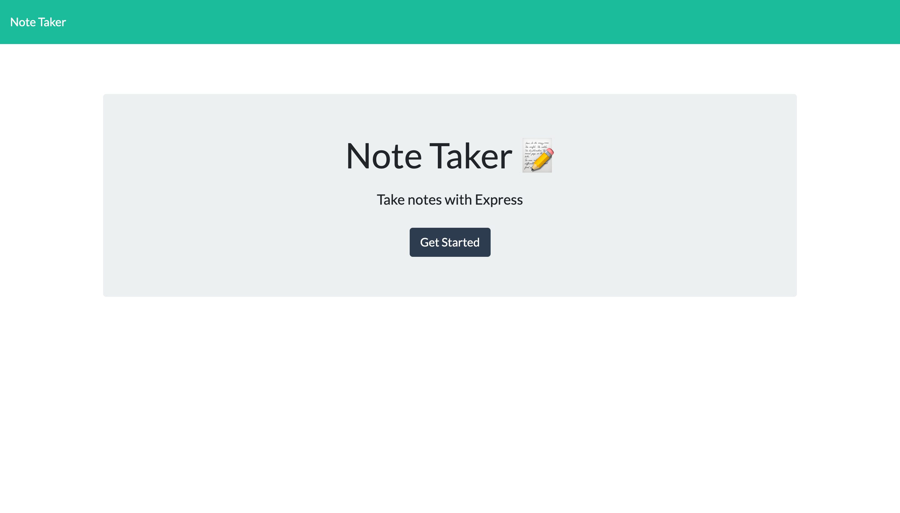
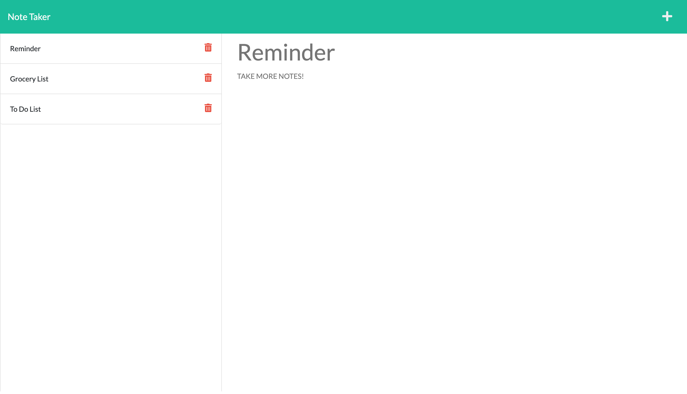

# Node Note Express

## Description:
This Express.js application utilizes HTML, CSS, Bootstrap, JavaScript, Node.js, and Node Package Manager (npm) to provide a front-end note-taking user interface experience in the Heroku Cloud Application Platform.

## Table of Contents
  - [Usage](#usage)
  - [Preview](#preview)
  - [Contribution](#contribution)
  - [Questions](#questions)
  - [Credits](#credits)

## Usage:
- Click on the Get Started button provided on the Node Note Express landing page to begin! Once you have been redirected to the notes page, enter the title and text of your note in the required and designated fields before clicking on the save icon that appears on the top right-hand side of the screen to the left of the add (+) icon. Once the save icon is clicked, your note will be saved on the left-hand side of the screen and can be viewed when clicked. Notes can be deleted by clicking on the trash icon to the right of each note.

> *Note: Once a note has been saved, deleting it along with its content is irreversible*

- To access Node Note Express, please click [HERE](https://node-note-express.herokuapp.com/)

## Preview:

## Contribution:
- Forking this repository is always welcomed and encouraged!

> If you encounter a problem with this application, please add an issue or pull request to the GitHub repository. 

## Questions:
- Please feel free to use this application at any time and visit my personal [GitHub](https://github.com/denysha-abigail) profile to access other open source projects! 

## Credits:
- *[Starter Code](https://github.com/coding-boot-camp/miniature-eureka)*
- *[Denysha Guerrios-Armaiz](https://github.com/denysha-abigail), 05/2022*